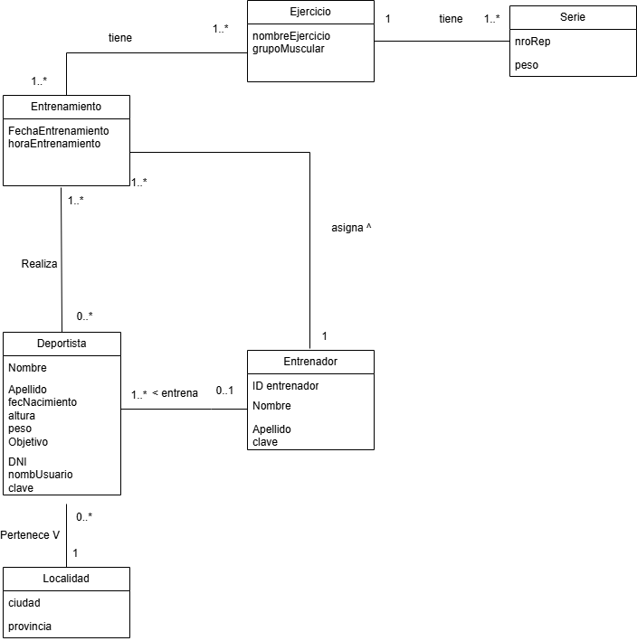

# Propuesta-Trabajo-Practico-DSW

## Grupo

### Integrantes
* 53411-Bertuzzi, Juan Ignacio  
* 52621-Diaz, Valentina Maria  
* 52181- Raimundo, Juan Cruz  

## Repositorios
--- 

## Tema

### Descripción  
Registro inteligente de entrenamiento deportivo. Aplicación web para deportistas y entrenadores que permite registrar entrenamientos de forma simple y visualizar automáticamente lo que se debe realizar en cada sesión, en base al progreso de semanas anteriores. El entrenador puede asignar rutinas, seguir el avance de sus atletas y ajustar los planes sin usar planillas manuales.

## Modelo

## Alcance Funcional

### Alcance Mínimo

| Req              | Detalle |
|------------------|---------|
| CRUD simple      | 1. CRUD Localidad   2. CRUD Entrenador    3. CRUD Grupo Muscular |
| CRUD dependiente | 1. CRUD Deportista {depende de} CRUD Entrenador   2. CRUD Ejercicio {depende de} CRUD Grupo Muscular |
| Listado + detalle| 1. Listado de entrenamiento filtrado por fecha o grupo muscular, muestra dia, hora, ejercicio, serie, repeticiones y peso => detalle CRUD entrenamiento   (2. Listado de deportistas de un entrenador filtrado por tipo de entrenamiento realizado, fecha y objetivo => detalle muestra datos completos del deportista y entrenamiento) |
| CUU/Epic         | 1. Cargar entrenamiento   2. Asignar entrenamiento y registrar progreso |

---

## Adicionales para Aprobación

### Req

| Tipo | Detalle |
|------|---------|
| CRUD |  |
| CUU/Epic | 1. Feedback del entrenadr o ejercicio |

---

